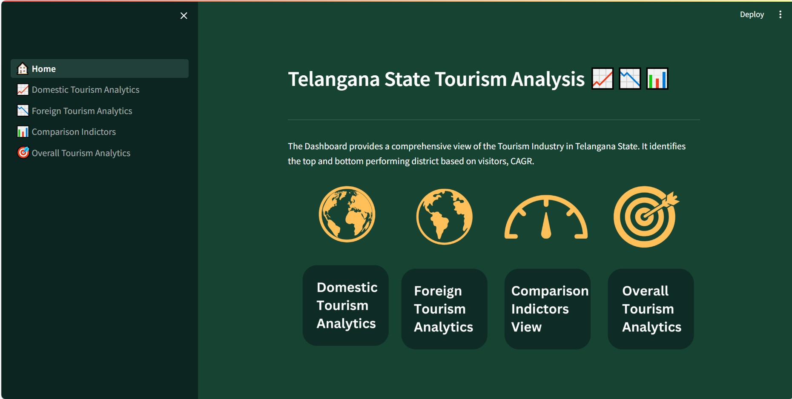
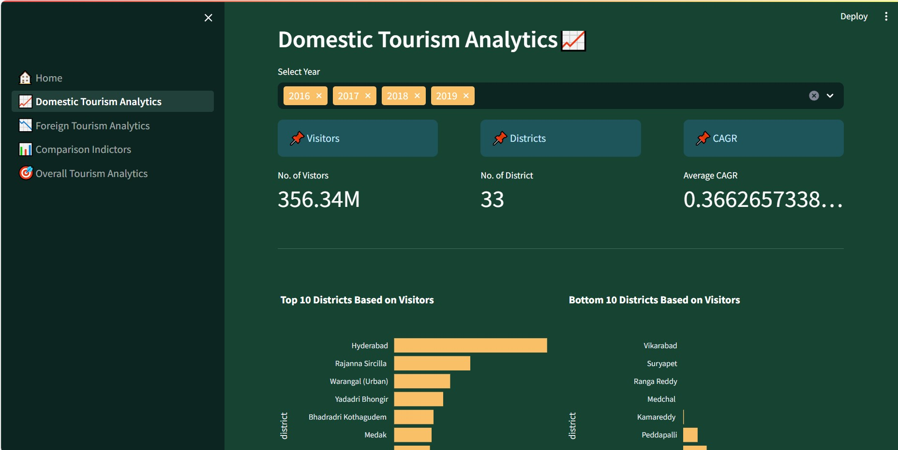

# Telangana State Tourism Analysis

The project aims to offer an in-depth examination of the tourism landscape within Telangana State, shedding light on its various facets and intricacies. Through meticulous analysis, the project seeks to identify both the top-performing and bottom-performing districts based on visitor statistics and Compound Annual Growth Rate (CAGR).

By leveraging robust data analysis techniques, we will delve into the visitor data spanning across different districts of Telangana State. Through this process, we aim to discern patterns, trends, and insights that characterize the tourism industry within the state. Our analysis will not only focus on the sheer number of visitors but also consider the growth trajectory represented by the CAGR metric.

The project will employ comparative analysis methodologies to discern disparities and similarities among districts. This will involve examining factors contributing to the success or decline of tourism in specific regions, such as infrastructure, attractions, marketing initiatives, and local policies.

The findings of this project will provide valuable insights for policymakers, tourism stakeholders, and investors. By pinpointing both exemplary and underperforming districts, stakeholders can strategize effectively to capitalize on opportunities for growth, address challenges, and optimize resource allocation within the tourism sector of Telangana State. Ultimately, this comprehensive analysis aims to contribute to the enhancement and sustainability of the tourism industry, fostering economic development and cultural enrichment across the region.

## Screenshots

